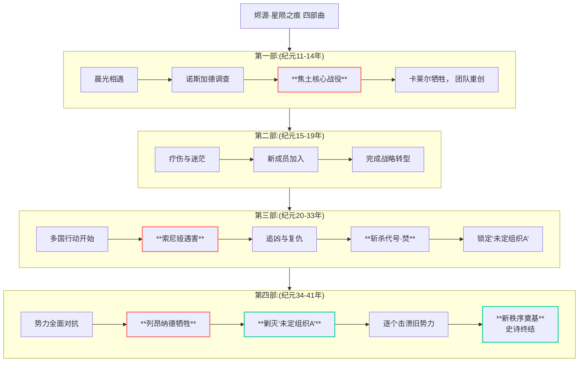

# 烬源·星陨之痕项目文档 (Project Fount·Trace Of Starfall) 

## 故事概述

《烬源·星陨之痕》是一部发生在**星陨纪元早期**（元年 - 纪元50年）的**英雄史诗与悲剧挽歌**。它描绘了在真理星陨落、心源初现的动荡年代里，一群年轻人如何被卷入时代的洪流，以希望与勇气对抗神权与阴谋，最终以血肉之躯在奥拉提卡的历史上刻下无法磨灭的“伤痕”。

故事以**成长与牺牲**为核心，通过主角团的视角，亲身经历诺斯加德的覆灭、联邦的虚伪、神使的残酷，以及凡人在神明博弈下的挣扎与光辉。

## 核心主题

- **希望与牺牲**：在注定悲剧的宿命中，个体的牺牲是否具有价值？
- **成长与代价**：从天真的理想主义到背负责任的成熟，需要付出何等惨痛的代价？
- **凡人与神明**：在神明意志笼罩的世界里，凡人的自由意志与抗争能否撼动命运的轨迹？
- **旧秩序的崩塌**：亲眼见证并参与一个旧时代的终结，并为之献上祭品。

## 主角团架构
1.  **[白明](../角色/核心角色/白明%20(Ela%20Leofreed).md)**
2.  **[卡莱尔·影歌](../角色/核心角色/卡莱尔·影歌%20(Carlyle%20Shadowgale).md)**
3.  **[索尼娅·米朵澈](../角色/核心角色/索尼娅·米朵澈%20(Sonia%20Midolce).md)**
4.  **[列昂纳德·斯托亚诺夫](../角色/核心角色/列昂纳德·斯托亚诺夫%20(Leonard%20Stoyanov).md)**

### 新的伙伴

在成员陆续牺牲的过程中，新的伙伴不断加入，承接他们的意志。

- **凯恩·艾尔丹缇**：来自**林域星海商会**的有钱人
- **伊利亚斯·瓦尔德**：来自**阿斯塔纳**的旧王。他经验丰富，拥有广泛的人脉和政治智慧，不断为团队提供资源、情报和战略指导，是团队后期的重要支柱。
- **构想中**：可能包括来自虹日宫的浪人、零点实验室的幸存者、联邦内部的改革派等，共同构成支持主角建立新国的核心班底。

## 对奥拉提卡设定的补充与影响

本故事直接塑造并深化了奥拉提卡的历史：

1.  **诺斯加德的毁灭**：详细描绘了其过程，使其不再是背景板，而是血与火的悲剧。
2.  **联邦的崩溃**：通过主角团的视角，亲身经历联邦从无能到实质崩溃的全过程。
3.  **代号·焚的落幕**：明确了这位重要反派在星陨纪元早期的结局，为正传《愿烬星迴》扫清了部分障碍，也留下了焰之神其他势力的悬念。
4.  **新国家的建立**：故事的结局直接改变了奥拉提卡的政治地图，为正传的故事舞台提供了全新的、动态的背景。这个新国家将成为正传中对抗危机、连接外界文明的关键力量。
5.  **心源体系的实战展示**：作为前传，本作将具体展示心源力量在实战中的应用、成长与代价，为整个系列的力量体系奠定直观基础。

